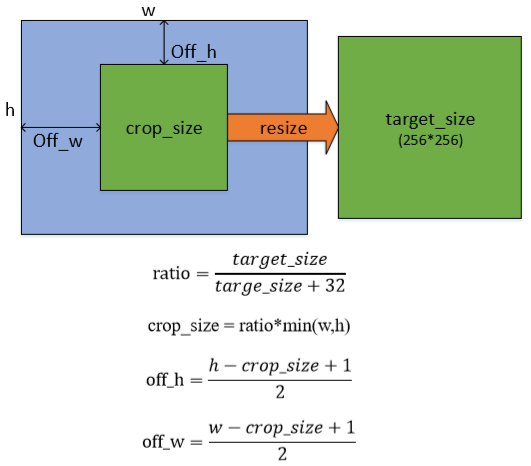

# ImageNet  preprocess

​                                                                                                                                                                   — XJTU_Tripler
## Methods

all the image preprocessing operations in our program are as following:

- Cropping out a square area: the length/width is about 89% of the shorter side of the original picture ,the square area is the green square as shown in the figure below



- Resizing/Scaling the square area to 256x256, where the **bicubic-interpolation** algorithm is preferred, and the resized images are saved in BMP format;

## Prerequisites

- Python environment (>=3.5) for 64 bits windows or Linux
- numpy==1.17.0
- pillow== 5.4.1
- other python library: os, absl-py

## Document

```
|-- ImageNet preprocess
|  |-- img              
|  |-- requirements.txt
|  |-- main.py
|  |-- README.md
```

## Instructions

- install the required [Python](https://www.python.org/) environment (>=3.5)

- enter our folder

    ```
    cd ImageNet_preprocess
    ```

- pip install the library which are required.

    ```
    pip install -r requirements.txt
    ```

- run the main function

    ```
    python main.py -init_dir=ImageNet_data_folder -new_dir=New_ImageNet_data_folder
    ```


## Acknowledgement

Thank you very much for your help.